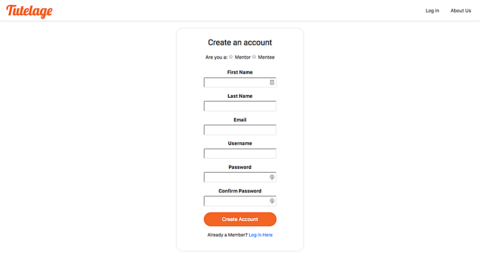
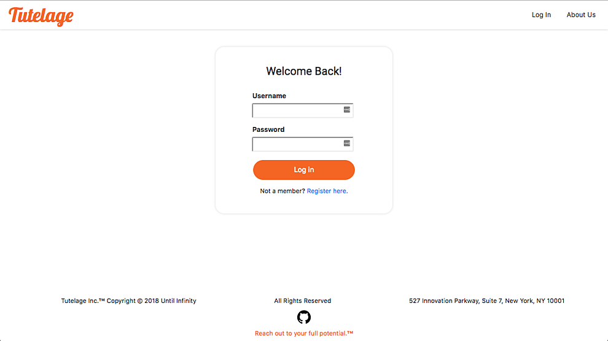

## Tutelage


## Description

Tutelage is a web application that allows individuals to find mentorship in a career field of their choosing from experienced experts.

## How does it work?

Tutelage works by allowing a "mentor" and a "mentee" to sign up for their accounts, respectively. Utilizing a matching algorithm, a mentee is paired with an ideal mentor to form a long-term, professional, mentoring relationship that will enrich the mentee's career path.


##### fig 1. The Landing Page.

---

##### fig 2. Register Page.

---

##### fig 3. Login Page.

---

##### fig 4. Profile.

---

##### fig 5. Search for mentors.

## Installation Guide

1. Fork Repo
2. Clone Repo into terminal as follows: 
```git clone git@github.com:crestrepo12/Tutelage.git```
3. Navigate to the following folders (frontend and backend) and install dependencies as follows:
```
$ cd frontend
$ npm install


$ cd ../backend
$ npm install
 ```


## Technologies

Backend

* [BCrypt](https://github.com/shaneGirish/bcrypt-nodejs)
* [Node.js](https://nodejs.org/en/)
* [Postgres](https://postgresapp.com/)


Frontend

* [CSS]()
* [HTML]()
* [React.js](https://reactjs.org/)
* [React Router](https://www.npmjs.com/package/react-router)
* [React Bootstrap](https://react-bootstrap.github.io/components/carousel/)

## Credits

* [Gerson Castillo, Technical Lead](https://github.com/Acostill)
* [Nick Chavez, Scrum Master](https://github.com/nickst3r610)
* [Gregory Davis, Product Manager](https://github.com/davisgreg1)
* [Eddie Harmon, Demo Lead](https://github.com/EddieHarmonJr)
* [Carolina Restrepo, Design Lead](https://github.com/crestrepo12)
